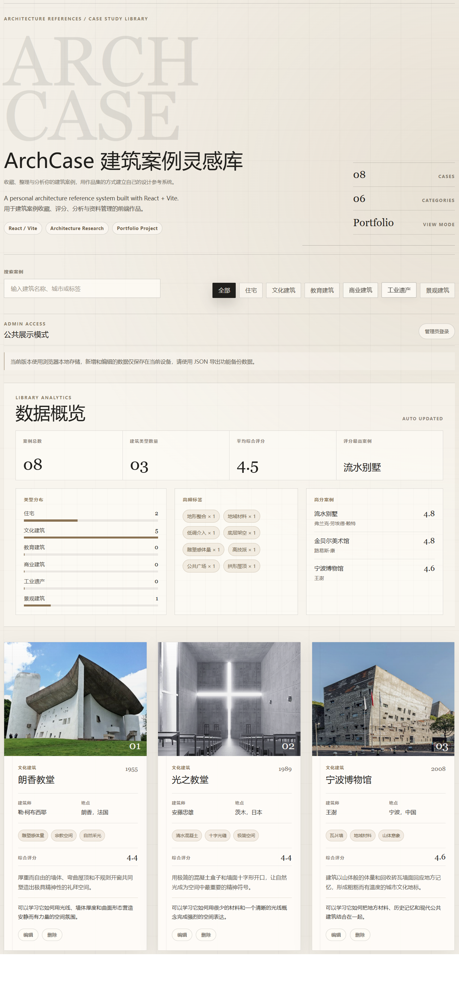

# ArchCase 建筑案例管理系统

## 在线预览

访问地址：[https://archcase.vercel.app/](https://archcase.vercel.app/)

ArchCase 是一个面向建筑案例整理与作品集展示的前后端项目，使用 React + Vite 构建前端界面，使用 Node.js + Express 提供后端 API。项目围绕“公共展示 + 管理员编辑”的产品逻辑设计：普通访客可以浏览案例、搜索筛选和查看详情；管理员登录后可以新增、编辑、删除案例，并上传建筑图片。

这个项目适合用于产品经理实习作品集、AI Coding 实践复盘、前端项目展示和建筑学学生的案例资料管理展示。

## 项目截图



## 项目亮点

- 公共展示与管理员管理分离：访客只浏览，管理员登录后才显示管理操作。
- 建筑作品集式界面：极简、网格、留白、杂志感，适合展示建筑案例。
- 后端 API 数据管理：案例数据通过 Express 接口读取和写入，不再只依赖浏览器本地数据。
- 图片上传能力：管理员可以上传图片，后端保存到 `server/uploads` 并返回图片 URL。
- 搜索与分类筛选：支持按建筑名称、建筑师、城市、国家、类型、标签和文本内容检索。
- 评分与统计面板：支持多维评分、平均评分、类型分布、高频标签和高分案例展示。
- 本地缓存 fallback：后端连接失败时，前端会使用 localStorage 缓存数据，避免页面白屏。

## 技术栈

- 前端：React、Vite、JavaScript、CSS
- 后端：Node.js、Express
- 数据存储：`server/data/cases.json` 临时 JSON 数据库
- 图片上传：Multer、`server/uploads`
- 权限控制：管理员登录、sessionStorage 保存登录状态、Bearer Token 请求校验
- 本地容错：localStorage 作为后端连接失败时的 fallback

## 功能模块

### 访客功能

- 浏览建筑案例卡片
- 搜索建筑名称、建筑师、城市、国家、类型、标签、简介和设计启发
- 按建筑类型筛选案例
- 查看案例详情弹窗
- 查看图片大图预览
- 浏览数据统计面板

### 管理员功能

- 管理员登录
- 新增建筑案例
- 编辑已有案例
- 删除案例
- 上传建筑图片
- JSON 数据导入 / 导出
- 重置默认案例

### 数据与分析功能

- 建筑案例评分系统
- 案例总数统计
- 类型分布统计
- 平均综合评分
- 高频标签统计
- 高分案例排行

## 项目结构

```text
ArchCase
├─ server
│  ├─ data
│  │  └─ cases.json
│  ├─ src
│  │  └─ index.js
│  ├─ uploads
│  ├─ .env.example
│  ├─ package.json
│  └─ README.md
├─ src
│  ├─ assets
│  │  └─ cases
│  ├─ components
│  │  ├─ AdminLogin.jsx
│  │  ├─ CaseCard.jsx
│  │  ├─ CaseDetailModal.jsx
│  │  ├─ CaseModal.jsx
│  │  ├─ DataTools.jsx
│  │  └─ StatsPanel.jsx
│  ├─ data
│  │  └─ cases.js
│  ├─ utils
│  │  └─ ratings.js
│  ├─ App.jsx
│  ├─ main.jsx
│  └─ styles.css
├─ index.html
├─ package.json
├─ vite.config.js
└─ README.md
```

## 环境变量配置

后端需要配置管理员账号和密码。不要把真实密码写入 README 或前端代码。

进入后端目录：

```bash
cd server
```

复制环境变量示例文件：

```bash
copy .env.example .env
```

在 `server/.env` 中配置：

```env
PORT=3001
FRONTEND_ORIGIN=http://localhost:5173,http://127.0.0.1:5173
ADMIN_USERNAME=admin
ADMIN_PASSWORD=your-admin-password
```

其中 `ADMIN_PASSWORD` 请改成你自己的密码。

## 启动方法

### 1. 启动后端

第一次运行后端前安装依赖：

```bash
cd server
npm install
```

启动后端服务：

```bash
npm run dev
```

后端默认运行在：

```bash
http://localhost:3001
```

测试后端是否运行：

```bash
http://localhost:3001/api/health
```

如果返回 `status: ok` 和 `service: archcase-server`，说明后端启动成功。

### 2. 启动前端

回到项目根目录：

```bash
cd ..
```

第一次运行前端前安装依赖：

```bash
npm install
```

启动前端：

```bash
npm run dev
```

前端通常运行在：

```bash
http://localhost:5173
```

## 打包方法

在项目根目录运行：

```bash
npm run build
```

打包后的文件会生成在 `dist/` 目录中。

## 主要接口

- `GET /api/health`：测试后端服务
- `GET /api/cases`：获取全部案例
- `POST /api/cases`：新增案例，需要管理员凭证
- `PUT /api/cases/:id`：编辑案例，需要管理员凭证
- `DELETE /api/cases/:id`：删除案例，需要管理员凭证
- `POST /api/upload`：上传图片，需要管理员凭证
- `POST /api/admin/login`：管理员登录

## 适合展示的项目价值

- 产品逻辑清晰：从单纯的案例展示，升级为公共浏览与后台管理分离的系统。
- AI Coding 实践完整：项目经历了静态页面、数据驱动、搜索筛选、CRUD、上传、后端 API、权限控制等阶段。
- 适合产品经理实习讲述：可以说明用户角色、权限边界、数据流、异常兜底和后续迭代方向。
- 适合前端作品集展示：有完整 UI、交互、状态管理、接口请求、错误处理和响应式页面。

## 后续优化方向

- 使用数据库替代 JSON 文件，例如 SQLite、MongoDB 或 PostgreSQL。
- 增加更完整的管理员鉴权，例如 JWT、Token 过期时间和退出登录接口。
- 增加公开展示页和管理员后台页的路由拆分。
- 增加案例排序、标签筛选和收藏标记。
- 增加图片压缩和图片删除清理策略。
- 增加表单 loading、保存成功提示和接口错误提示组件。
- 部署后端服务，并把前端 API 地址改为环境变量配置。
